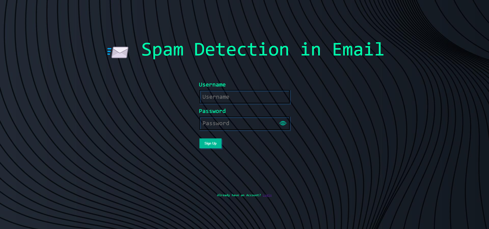
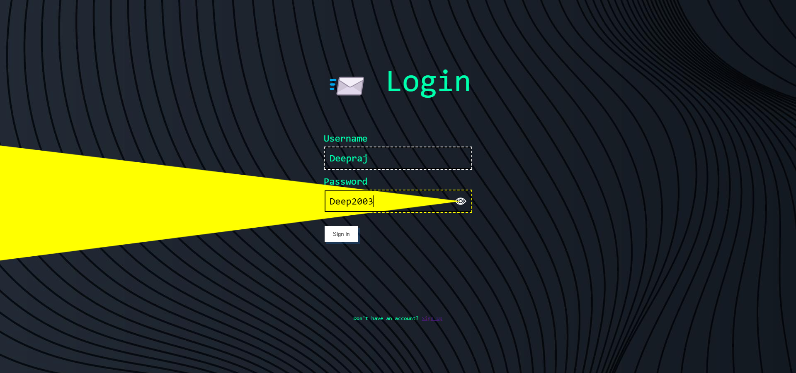
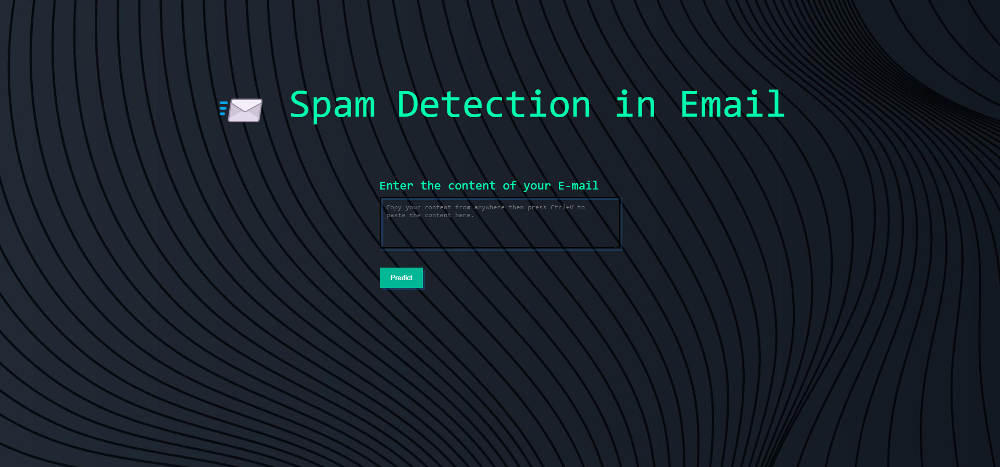

# School of Computer Science <br> KIIT <br> Course: Computer Networks (IT-3009) <br> Project Topic: Suspicious Email Detection

## Team Members: <br> Deepraj Bera   21051302 <br> Abhishek Mallick   21051706 <br> Soumyabrata Samanta   21051436 <br> Abhrajit Das   21051026


**Introduction:** <br>
In today's interconnected world, email remains one of the primary communication channels.However, the rise of cyber threats, including phishing and malware distribution through emails, has necessitated the development of robust techniques for detecting suspicious emails. This project aims to explore the intricacies of email-based cyber threats and equip students with the skills to design and implement a Suspicious Email Detection system using concepts from computer networks.

**Project Objectives:**

1. **Understanding Email Threats:**
   - Goal: Develop a comprehensive understanding of various `email threats`, including `phishing, malware, and spam`, and their potential impacts on users and systems.

2. **Dataset Acquisition:**
   - Goal: Identify and collect a suitable dataset comprising both legitimate and suspicious emails for training and evaluation purposes. A diverse and representative dataset is crucial for effective model training.
   - Collected the `Dataset` from <a href="https://www.kaggle.com/datasets/venky73/spam-mails-dataset/data">Kaggle</a>
   - The code starts by loading email data from a CSV file named 'mail_data.csv' into a pandas DataFrame.
     <br><br>
     ```
     raw_mail_data = pd.read_csv('mail_data.csv')
     ```

3. **Preprocessing and Feature Extraction:**
   - Goal: Preprocess email data by addressing text, attachments, and headers. Extract relevant features from the data to facilitate the detection process. Proper preprocessing ensures the model's ability to discern patterns in the data.
   - It replaces null values with an empty string.
   - It then labels the data, assigning 'spam' emails a label of 0 and 'ham' (non-spam) emails a label of 1.
   <br><br>
     ```
     mail_data = raw_mail_data.where((pd.notnull(raw_mail_data)), '')
     mail_data.loc[mail_data['Category'] == 'spam', 'Category'] = 0
     mail_data.loc[mail_data['Category'] == 'ham', 'Category'] = 1
     ```

4. **Data Splitting:**
   - The data is split into training and testing sets using the `train_test_split` function from scikit-learn.

     ```python
     X = mail_data['Message']
     Y = mail_data['Category']
     X_train, X_test, Y_train, Y_test = train_test_split(X, Y, test_size=0.2, random_state=3)
     ```


5. **Text Feature Extraction:**
   - The text data is transformed into feature vectors using the TF-IDF vectorizer (`TfidfVectorizer`) from scikit-learn. This is a common technique in natural language processing to convert text data into numerical features.

      ```python
      feature_extraction = TfidfVectorizer(min_df=1, stop_words='english', lowercase=True)
      X_train_features = feature_extraction.fit_transform(X_train)
      X_test_features = feature_extraction.transform(X_test)
      ```

6. **Model Training:**
   - A Logistic Regression model is chosen and trained on the transformed text features.

      ```python
      model = LogisticRegression()
      model.fit(X_train_features, Y_train)
      ```

7. **Model Evaluation:**
   - The accuracy of the model is evaluated on both the training and test datasets.

      ```python
      # Accuracy on training data
      accuracy_on_training_data = accuracy_score(Y_train, prediction_on_training_data)
      
      # Accuracy on test data
      accuracy_on_test_data = accuracy_score(Y_test, prediction_on_test_data)

      # Confusion Matrix
      conf_matrix = confusion_matrix(Y_test, prediction_on_test_data)

      # Classification Report
      class_report = classification_report(Y_test, prediction_on_test_data)

      # Calculate AUC-ROC
      prediction_on_training_data_prob = model.predict_proba(X_train_features)[:, 1]
      prediction_on_test_data_prob = model.predict_proba(X_test_features)[:, 1]
      
      roc_auc_train = roc_auc_score(Y_train, prediction_on_training_data_prob)
      roc_auc_test = roc_auc_score(Y_test, prediction_on_test_data_prob)

      # Plot ROC Curve for test data
      fpr, tpr, _ = roc_curve(Y_test, prediction_on_test_data_prob)
      roc_auc = auc(fpr, tpr)
      ```
8. **Implementation:**
   - Goal: Implement the designed system using a programming language such as Python. Leverage libraries and frameworks for machine learning and text analysis to streamline the development process.
   - **Open Source Contribution**
  
     ```python
     git clone https://github.com/deepraj21/Spam-email-detection
     pip install -r requirements.txt
     flask run
     ```
     

9. **Validation and Testing:**
   - Goal: Validate the system's effectiveness through rigorous testing methodologies, including cross-validation techniques and parameter tuning. This step ensures the robustness and reliability of the Suspicious Email Detection system under different scenarios.

By achieving these objectives, the project aims to equip individuals with the skills and knowledge needed to address the evolving challenges posed by email-based cyber threats. The combination of understanding threats, acquiring and processing data, selecting appropriate algorithms, designing effective models, and rigorous evaluation contributes to the development of a robust and reliable email threat detection system.

## Webapp Preview





## License

This project is licensed under the MIT License - see the [LICENSE](LICENSE) file for details.
